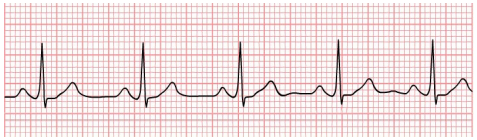
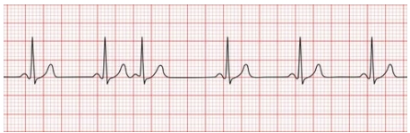

## Arrhythmias recognition in ECG signals
*Project for the course in APPLIED AI IN BIOMEDICINE at Politecnico di Milano*

Arrhythmias are one of the most common types of Cardiovascular disease and one of the top causes of mortality in the world. The diagnosis of arrhythmias is a time-consuming task for specialists since it usually involves the manual inspection of electrocardiogram (ECG) recordings. 

For this reason, computer-aided diagnosis systems are an efficient tool to provide accurate automatic diagnosis of arrhythmias from the analysis of ECG signals.

   

In this project, I train a *Wide-ResNet* model to classify ECG signals relative to single heartbeats. The model is the combination of a 1D *ResNet* that takes as input the ECG signal, and a *FFNN* that takes as input some additional features imputed from the ECG recording (e.g., distance from the peaks).

*Data Augmentation* and *Weighting* are used to account for the class imbalance in the dataset (anomalous heartbeats are rare overall).

The trained model achieved *Accuracy* of ~98%, *Precision* of ~87%, and *Recall* of ~95%.

